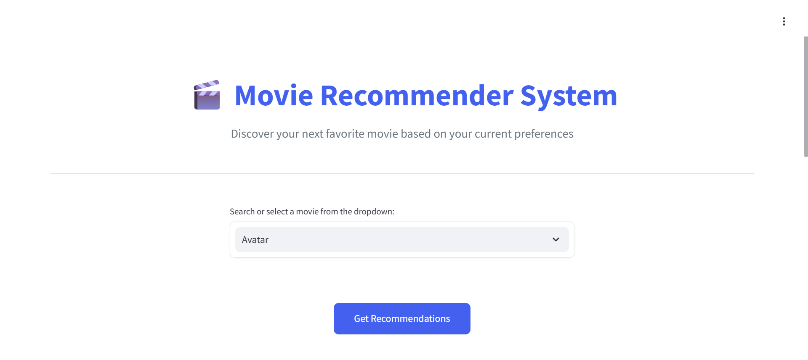
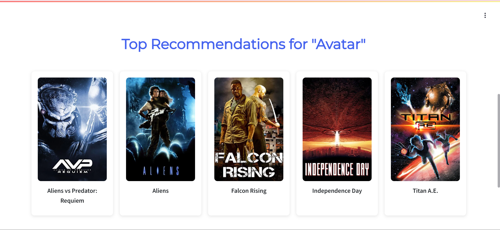

# 🎬 Movie Recommendation System

---

## 📝 Introduction

This Movie Recommendation System uses **content-based filtering** to suggest movies similar to a user’s favorite. By analyzing key features such as genres, keywords, cast, director, and movie overview, it leverages natural language processing (NLP) and machine learning (ML) techniques to find meaningful similarities between movies and provide personalized recommendations.

---

## 📄 Abstract

With the rapid growth of online movie platforms, finding movies that align with individual tastes has become essential. This project addresses that by implementing a content-based recommendation approach, focusing on movie attributes instead of user ratings or behavior. The system processes and merges multiple datasets, applies text preprocessing and vectorization, then calculates similarity scores to deliver relevant movie suggestions — enhancing user experience through smart discovery.

---

## ✨ Features

- Input any movie title and get **top 5 similar movie recommendations**
- Uses **content-based filtering** instead of collaborative filtering
- Combines multiple movie features: genres, cast, keywords, director, overview
- Applies NLP techniques such as stemming and stopword removal
- Easy to extend into a web app with Streamlit or Flask
- Clean and commented Python code for ease of understanding and modification

---

## 🖼️ Screenshots



---

## 🌐 Live Demo

Try the live demo here:  
[https://movie-recommender-system-sv6m.onrender.com/](https://movie-recommender-system-sv6m.onrender.com/)  


---

## 🛠️ Tech Stack

- **Programming Language**: Python 🐍  
- **Libraries & Tools**:
  - pandas
  - numpy
  - scikit-learn
  - nltk
  - ast
- **Development Environments**: VS Code, Jupyter Notebook  
- **Data Source**: TMDB 5000 Movie Dataset from Kaggle

---

## 🧠 Approach

1. **Data Collection & Merging**  
   Combined movie metadata and credits datasets on movie titles.

2. **Feature Extraction & Engineering**  
   Extracted relevant columns: genres, keywords, cast (top 3 actors), director, and overview. Merged these into a single “tags” column.

3. **Text Preprocessing**  
   - Converted to lowercase  
   - Removed spaces and punctuation  
   - Applied stemming using NLTK’s PorterStemmer  

4. **Vectorization**  
   Used `CountVectorizer` to transform text data into numerical vectors, limiting to the top 5000 words and removing stopwords.

5. **Similarity Computation**  
   Calculated cosine similarity between movie vectors to quantify similarity scores.

6. **Recommendation Generation**  
   Based on input movie title, output the top 5 most similar movies by similarity score.

---

## ⬇️ Cloning the Repository

```bash
git clone https://github.com/yourusername/movie-recommendation-system.git
cd movie-recommendation-system

---

## 🔮 Future Enhancements

- Build a web frontend using **Streamlit** or **Flask** for interactive UI  
- Deploy the app on cloud platforms such as **Heroku**, **Render**, or **Streamlit Share**  
- Incorporate **collaborative filtering** based on user behavior and ratings  
- Add **movie posters, ratings, and trailers** to recommendations  
- Implement a **search bar with autocomplete** for better user experience  
- Support **multi-language** movie datasets and recommendations  
